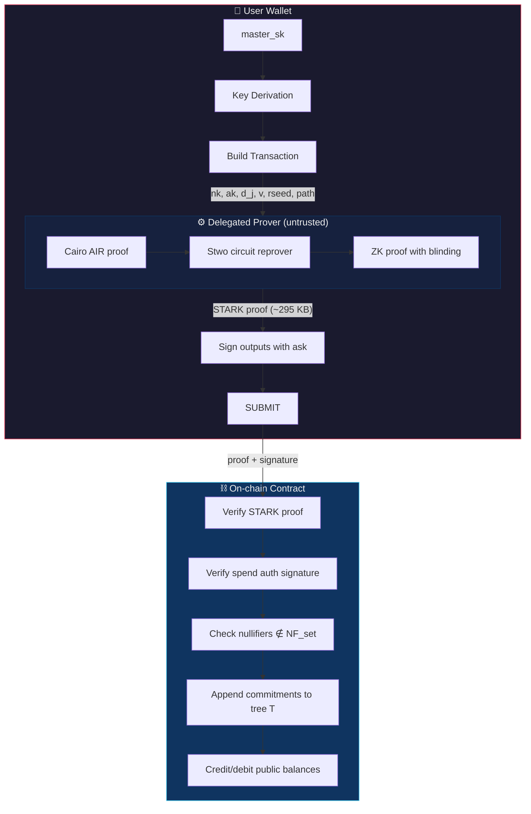

# StarkPrivacy


**Post-quantum private transactions with STARK proofs.**

Privacy on blockchains today relies on elliptic curve cryptography that quantum computers will break. StarkPrivacy replaces every elliptic curve with post-quantum alternatives — BLAKE2s hashing, ML-KEM lattice-based encryption, and STARKs — while keeping proofs small (~295 KB) and verification instant (~35 ms).

### Features

- **Post-quantum end-to-end.** No elliptic curves anywhere. BLAKE2s for commitments and nullifiers, ML-KEM-768 for encrypted memos, STARKs for proofs. A quantum computer breaks nothing.
- **~295 KB zero-knowledge proofs.** Two-level recursive STARKs (Cairo AIR → Stwo circuit reprover) with ZK blinding. Proves the transaction is valid without revealing sender, recipient, or amount.
- **Delegated proving.** Outsource the expensive proof generation (~35s) to an untrusted server. Sapling-style key splitting ensures the prover can't steal funds, redirect payments, or learn about your other transactions.
- **Fuzzy message detection.** ML-KEM-based detection keys let a lightweight indexer flag likely-incoming transactions without being able to read them. Tunable false-positive rate for plausible deniability.
- **Diversified addresses.** Generate unlimited unlinkable addresses from a single master key. Receive payments at different addresses, scan them all with one viewing key.
- **1 KB encrypted memos.** Each note carries an end-to-end encrypted memo for payment references, messages, or metadata. Only the recipient can read it.
- **Flexible N→2 transfers.** Consolidate up to 16 notes in a single proof. Split one note into two. No dummy notes needed.

### How it works

A UTXO-based private transaction system where:
- **Deposits** (shield) move public tokens into private notes
- **Transfers** spend 1–16 private notes and create 2 new ones (payment + change)
- **Withdrawals** (unshield) destroy private notes and release value publicly
- Every spend is proven with a **zero-knowledge STARK** (~295 KB, 96-bit security)

## Quick start

```bash
# Run the demo (no blockchain, just the cryptographic state machine)
cd demo && cargo run

# Run the STARK proofs (requires ~13 GB RAM)
scarb build
./bench.sh
```

## Architecture



## Key hierarchy

```
master_sk
├── spend_seed
│   ├── nk          — account nullifier key (one per account)
│   └── ask_base    — authorization derivation root
│       └── ak_j    — per-address auth verifying key
│
└── incoming_seed
    └── dsk         — diversifier derivation key
        └── d_j     — per-address diversifier
```

- **nk** given to the prover (can generate proof but not authorize spend)
- **ask** never leaves the wallet (signs proof outputs after the fact)
- **d_j** identifies which address a note was sent to
- **ak** bound into the commitment — prevents prover from redirecting funds

## Note structure

```
cm = H_commit(d_j, v, rcm, ak)    — commitment (in Merkle tree)
nf = H_null(nk, cm)               — nullifier (prevents double-spend)
```

The commitment binds to the address, value, randomness, AND the authorization key. The nullifier binds the account-level key to the commitment. Different BLAKE2s personalization strings prevent cross-domain collisions.

## Circuits

| Circuit | Inputs | Outputs | Purpose |
|---------|--------|---------|---------|
| **Shield** | 0 notes | 1 note | Deposit public tokens into a private note |
| **Transfer** | 1–16 notes | 2 notes | Private payment + change (or split/consolidate) |
| **Unshield** | 1–16 notes | 0–1 notes + public withdrawal | Withdraw to a public address |

Transfer with N=1 eliminates the need for dummy zero-value notes.

## Transaction sizes

| Type | Proof | Note data | Overhead | Total |
|------|-------|-----------|----------|-------|
| Shield | 295 KB | 3.2 KB | ~0.2 KB | **~298 KB** |
| Transfer (N=2) | 295 KB | 6.4 KB | ~0.5 KB | **~302 KB** |
| Unshield (N=1) | 295 KB | 0–3.2 KB | ~0.3 KB | **~295–298 KB** |

Each output note carries ~3.2 KB: commitment (32 B) + ML-KEM detection ciphertext (1088 B) + ML-KEM memo ciphertext (1088 B) + encrypted data with 1 KB user memo (1080 B).

## Post-quantum

No elliptic curves anywhere:
- **Hashing**: BLAKE2s-256 (personalized IVs, 251-bit truncated for felt252)
- **Proofs**: STARKs via Stwo (two-level recursive: Cairo AIR → circuit reprover)
- **Memo encryption**: ML-KEM-768 + ChaCha20-Poly1305
- **Detection**: ML-KEM-768 fuzzy message detection with 10-bit tags

## Delegated proving

Proof generation (~30–50s, ~13 GB RAM) can be outsourced to an untrusted prover:

1. User gives the prover: `(nk, ak, d_j, v, rseed, Merkle path)` per input note
2. Prover generates the STARK proof
3. User signs the proof outputs with `ask` (one hash)
4. Submit proof + signature on-chain

The prover **cannot steal funds** (doesn't have `ask`), **cannot redirect payments** (`ak` is bound into the commitment), and **cannot learn about other transactions** (per-address keys are pseudorandom).

## Project structure

```
src/                    Cairo circuits
  blake_hash.cairo      BLAKE2s with personalized IVs
  merkle.cairo          Merkle tree verification
  shield.cairo          Shield circuit (0→1)
  transfer.cairo        Transfer circuit (N→2)
  unshield.cairo        Unshield circuit (N→change+withdrawal)
  common.cairo          Test note data and key derivation
  tree.cairo            Merkle tree construction (witness generation)
  step_*.cairo          Test executables

reprover/               Two-level recursive STARK prover (Rust)
  custom_circuit.rs     Circuit reprover (Cairo proof → ZK circuit proof)
  main.rs               CLI: generate proofs from .executable.json

demo/                   Rust demo (no blockchain, no proofs)
  main.rs               Full protocol simulation with ML-KEM

spec.md                 Protocol specification
bench.sh                Benchmark script
```

## Running benchmarks

```bash
# Default: recursive proofs (ZK, ~295 KB)
./bench.sh

# Faster testing with smaller Merkle tree
./bench.sh --depth 16
```

Sample results (depth=48, 4-core machine):

| Operation | Cairo prove | Circuit prove | Total | Proof |
|-----------|------------|---------------|-------|-------|
| Shield | 18s | 17s | 37s | 285 KB |
| Unshield (N=1) | 27s | 17s | 46s | 296 KB |
| Join (N=2) | 20s | 18s | 40s | 299 KB |
| Split (N=1) | 24s | 18s | 44s | 295 KB |

## Known limitations

- **`ak` sender-timing leak**: the sender knows `ak` and can see when the note is spent on-chain. Requires blinded lattice signatures to fix (future work).
- **N is not private**: the number of nullifiers reveals how many inputs were consolidated.
- **Detection is honest-sender**: a malicious sender can bypass detection by submitting bogus detection data. The recipient falls back to full scanning.
- **`ml-kem` crate is a release candidate**: track stable release for production.

## License

Copyright (c) 2026 Arthur Breitman. All rights reserved.
